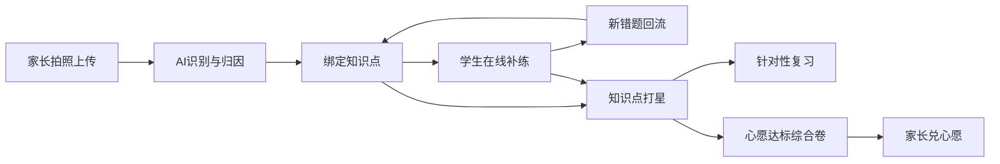
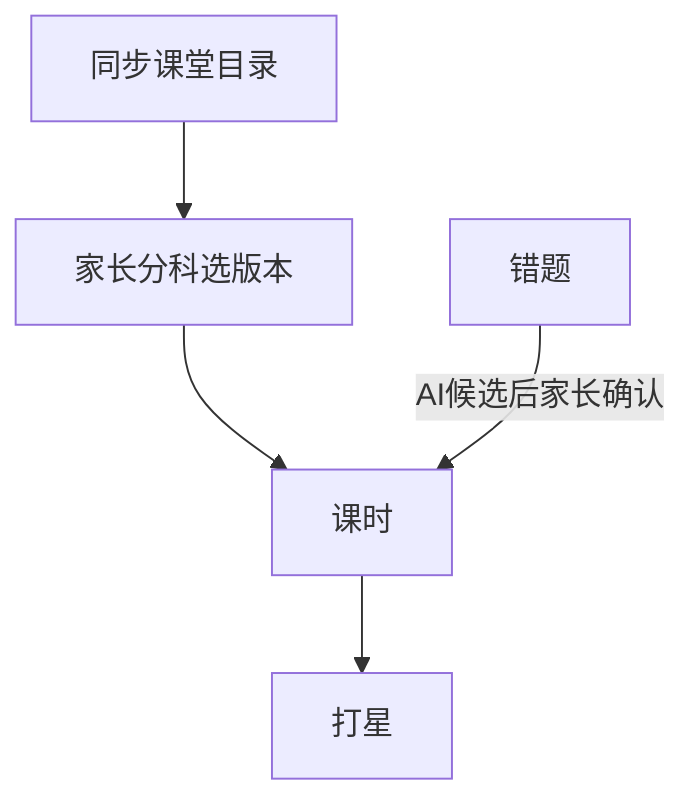
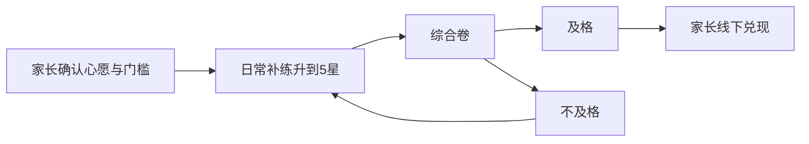
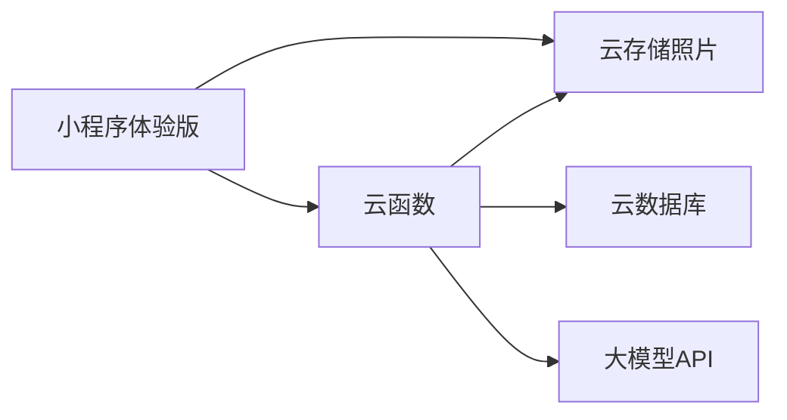

# 初中作业错题补漏 · 产品设计（待确认）

> 落盘：2026-08-24，路径 `doc/plan/错题补漏产品设计.md`。与对话中确认的产品计划一致。

## 问题怎么定义

**How Might We：** 如何让家长用最少操作把作业错题变成「可追踪的知识点掌握度」，让孩子只在薄弱点上练，而不是把整张卷子再做一遍。

核心痛点不是「再拍一张照片」，而是：**错题散落、不会归因、不会出针对性题、复习没有优先级**。

## 推荐方向（已按你的选择收敛）

- **操作者：家长**（拍照、确认科目/对错、催练）
- **学习者：学生**（在线答题、看解析、复习）
- **形态：微信小程序（不正式上架）**，开发版/体验版仅家人微信号可用；学科首期数/理/化/英
- **后端：微信云开发**（云函数 + 云数据库 + 云存储），不自建机房/不买云主机
- **一句话价值：** 家长拍一次，系统管「错在哪、缺哪块、下次练什么、星级怎么变」；达标后用综合卷检验，再兑心愿

不做成题库刷题 App，也不做成纯 OCR 相册。主线是 **错题 → 知识点 → 补练 → 星级 → 心愿检验** 闭环。



## 角色与账号

| 角色 | 做什么 | 不做什么（首期） |
| --- | --- | --- |
| 家长 | 建孩子档案、选年级学科、拍照、核对识别结果、查看掌握度、布置/提醒补练、**作业计时与时长查看**、维护心愿单与兑奖门槛、确认兑现 | 不代替孩子完成全部答题（可代看解析）；不在小程序里支付实物 |
| 学生 | 用微信进入「今日补练」、答题、看错因与知识点、**看心愿进度、打达标综合卷**；可自己点开始/暂停作业计时 | 不强制自己拍照；不能自己把心愿标成已兑现 |

建议：**每个微信号加入一个家庭，并固定一个角色（家长或学生）**。家长创建家庭并生成邀请码（邀请码指定某个孩子档案）；学生用自己的微信打开体验版后加入。一期：一号一家庭、一号一角色；**一家庭可多名孩子**。学生角色成员必须挂一个 `childId`。学生微信尚未加入时，**家长角色可代答**。

家长拍照/计时等：**成员里只有一名学生 → 默认记到该学生**；多名学生必须选择。无学生成员时：一份孩子档案默认，多份必选。

建档必填：**年级** + **分科教材版本**（每科可不同）。版本选项只来自同步课堂已上线的初中教材筛选列表。

## 核心场景（每日）

1. **写纸质作业时（家长或孩子）**  
   今日页选学科 → 开始计时 → 可暂停 → 结束。时长写入云端，和当天错题、补练分开记账。
2. **放学后 5 分钟（家长）**  
   拍作业/试卷错题页（可多图）→ 选科目与来源（作业/单元测/模拟）→ AI 出结果 → 家长核对：题干、对错、科目。
3. **当晚或次日（学生）**  
   「今日待练」：针对本次错题知识点出 3～8 题（短、能完成）。
4. **周末（家长看一眼）**  
   学科雷达/星级列表、本周各科作业时长；若主心愿已满星，孩子打综合卷，及格后家长兑现。

## 功能模块（信息架构）

建议底部 4 Tab（家长视角为主；学生进入后默认落到「练习」）：

1. **今日**  
   **作业计时（开始/暂停/结束）**、待核对识别、待练题包、未完成提醒、当日已用时长。
2. **错题本**  
   按学科 / 知识点 / 时间筛选；每条：原图裁剪、题干、错因、关联知识点、掌握星级、再练入口。
3. **掌握度**  
   学科 → 章节 → 知识点；1～5 星；「疑似遗漏」（作业覆盖了章节但该知识点从未出现对/错记录）。
4. **我的**  
   孩子档案、年级、**分科教材版本**、开启学科、当前进度（学到哪一章，可选）、**心愿单**、通知、**家庭成员与邀请**。

掌握度页展示「距下一档心愿还差几颗满星课时」。今日 Tab 在达标时可出现「去考综合卷」。

## 知识点权威来源（已收敛：三层都以同步课堂为准）

**可以。** 私人家庭场景下，把原先三层都收到 [同步课堂](https://basic.smartedu.cn/syncClassroom) 一套对照源，产品更简单、也够「官方」。

| 原三层 | 现以同步课堂为准 |
| --- | --- |
| 用哪套书 | 筛选项里的学段/年级/学科/版本/册次（平台没有的版本不提供） |
| 第几章 | 平台该册的章 → 课时/节标题 |
| 学什么、打星 | 默认打在 **课时** 上；课时下若平台只有课名、没有更细考点，就用课时当知识点，需要更细再按该课时内容人工拆 1～N 条（仍挂在该课时下） |

对照入口示例：[带 defaultTag 的同步课堂](https://basic.smartedu.cn/syncClassroom?defaultTag=e7bbce2c-0590-11ed-9c79-92fc3b3249d5%2F44bebf7c-54e6-11ed-9c34-850ba61fa9f4%2Fe7bbcf80-0590-11ed-9c79-92fc3b3249d5%2Fff8080814371757b01437c363a187b0a%2Fff8080814371757b014390f883db0453%2F5136342961)。

知识图谱：

```text
初中 → 年级 → 学科 → 版本 → 册次 → 章 → 课时/节（= 默认知识点与打星单位）
```



需要心里有数的边界（不挡私人使用）：

- 同步课堂是教育部平台上的 **同步课程目录**，权威来自「官方平台上这套书怎么排课」，**不是**课标 PDF 本身；平台未上线的版本无法选。
- 换教材版本后，掌握度 **不自动迁移**（绑的是课时 ID）。家庭通常一年内版本稳定，可接受。
- 采集公开目录元数据并按平台结构展示；不爬课件/视频/电子书，不写官方合作。

**遗漏探测：** 窗口 = 家长进度所在章/已学课时；遗漏 = 这些课时尚无对错记录或长期低星。

**采集与展示（新增）：** 从同步课堂采集 **初中各科、平台已上线的各教材版本** 的归纳结构（学段/年级/学科/版本/册次/章/课时及平台筛选 tag），在应用内 **按同一套层级筛选和展开展示**，不自制另一套章节名。采集范围仅限公开目录元数据（标题、层级、tag 路径）；**不下载、不转存** 课件、视频、电子书正文。

**覆盖：** 目录以平台当前已上线为准，缺的版本不能选。课时下若平台只有课名，知识点=课时名。

**拍照上传（独立流程，从今日进入）**

- 多图、可裁剪、可标注「这几题是错的」（圈选或点选题号，降低 AI 误判）。
- 家长必选：学科、年级、作业日期；教材版本默认取档案，可改。
- AI 输出：每题题干、选项/作答区、是否错题、错因简述、知识点候选（1～3 个）、置信度。
- **低置信度必须人工确认**，否则错题本会脏，星级会废。

**AI 分析（产品规则，不是技术细节）**

- 错因类型建议固定枚举：概念不清、计算失误、审题漏条件、公式用错、英语词汇/语法、实验/单位等（按学科子集）。
- 知识点必须挂到 **同步课堂该版本的课时**；禁止用中考网自编标签作为唯一绑定。
- 「所学部分是否有遗漏」：以当前进度章/课时为窗口，对比未练或低星课时，再出 1～3 道探测题。

**在线答题**

- 题型首期：选择、填空（短答案）、判断；英语可含选词。解答题只「看解析+标记会/不会」，不出自动批改（全科里理化大题批改不准）。
- 交卷后：对的升星倾向、错的进错题本并降星或锁定「待巩固」。
- 同一知识点短间隔重复错：标记「顽固」，复习队列优先。

**打星规则（建议写进产品，避免拍脑袋）**

- 1 星：新错 / 探测未过  
- 2 星：补练对过 1 次  
- 3 星：间隔 2 天后再对  
- 4 星：间隔 ≥7 天再对  
- 5 星：两次间隔复习都对且近期无新错  

错一次：降 1 星（最低 1）。家长可手动改星（纠偏），记「人工」。

**针对性复习**

- 「今日复习」= 1～2 星 + 顽固 + 到期复习（3/4 星到期），总量控制在 **10 题以内**（家长场景：孩子能做完）。
- 支持按学科开关，避免一天数理化英全压上来。

## 作业计时（新增）

记的是 **「坐下写作业花了多久」**，不是监控有没有开小差。和错题、星级分开：时长短不等于掌握好。

**怎么用**

- 入口在「今日」：选学科（可「未分科」）→ 开始 → 暂停/继续 → 结束。同时只允许 **一段进行中的计时**。
- 开始时刻、暂停累计、结束时刻写入云开发，换手机也能看到进行中的段。
- 结束时可改学科、补一句备注（如「数学练习册 P12」）。忘记点结束：再次打开小程序提示「是否结束该段」，并展示已过时长；超过 **4 小时** 自动结束并标「可能忘关」（可家长改）。
- 小程序内 **补练 / 综合卷** 自动记「在线练习时长」（与纸质作业时长分开展示），不必再点开始。

**家长能看什么**

- 当日、本周：各科作业时长合计、在线补练时长。
- 不设「必须写满 N 分钟」才能交作业；不把时长算进心愿门槛（默认）。若以后要「连续 N 天完成计时」当附加条件，再单开开关。

**微信限制（产品上要接受）**

- 切到后台后计时仍按服务端开始时间算，不依赖手机后台保活。
- 计时期间建议亮屏（`保持常亮` 可选），避免锁屏误以为停了。
- **不做：** 后台偷偷计时、读其他 App、截屏巡查、摄像头监考。

## 奖励与心愿（新增）

目的：把打星从「记账」变成孩子愿意做完卷子的理由。小程序只做 **规则 + 检验 + 提醒家长兑现**，实物（玩具、出游、加餐）由家长线下给，不接支付。

**心愿单**

- 家长添加心愿：名称、可选备注/配图、**需要攒满的课时数**（或指定若干课时/某一章）、及格线（建议默认卷面 **80%**）、是否允许跨学科。
- 孩子可「许愿」，状态为待家长同意；未同意不计入可兑。
- 同时只推进 **1 个主心愿**（避免同时攒三个奖励、门槛混乱）；其余排队。
- 进度 = 该心愿绑定范围内、当前为 **5 星** 的课时个数（「完全掌握」沿用已有打星：两次间隔复习都对且近期无新错）。家长改星若标「人工」，是否计入由家长开关（默认 **不计入**，防止兑奖前把星改满）。

**兑现前必须过综合卷（检验）**

- 当 5 星课时数达到门槛，状态变为「可考试」，不能直接点兑现。
- 系统按这些已满星课时 **综合出一套卷**（建议 15～25 题，覆盖尽量多的达标课时，每课时至少 1 题；一次约 20～40 分钟）。
- 孩子一次做完；交卷后：
  - **及格：** 心愿变为「待家长兑现」。家长点「已兑现」才关闭。过期未兑现只催家长，不自动扣星。
  - **不及格：** 不兑现。错题进错题本，对应课时按打星规则降星，心愿退回「进行中」。冷却建议 **3 天内不可重考**（防刷卷）。
- 综合卷不是日常 10 题复习包，是兑奖闸门；考试中途不显示答案。



**不做：** 积分商城、现金红包、排行榜晒奖励、自动发货。

## 一期 / 二期

- **一期 =** 错题入库、同步课堂课时打星、补练/差缺、综合卷检验、纸质计时、家庭角色（不以「再砍 MVP」继续缩小，**兑心愿已明确挪到二期**）。
- **二期（仅规划）：费曼学习法**——孩子把某课时用自己的话讲出来（给家长听或对小程序「听众」），对照同步课堂课时；记录讲解与卡点，用来发现「会做不会讲」的漏洞。可与补练、打星衔接，具体交互与是否改星 **二期再开 SPEC/任务卡**。一期不做讲解录制、费曼检查清单、讲课评分。

## 一期目标（当前实现范围）

- 家长多图上传 + 核对错题与知识点  
- 错题本 + 知识点绑定  
- 按知识点出小题、在线作答、错题回流  
- 章节遗漏探测（小数量）  
- 1～5 星与今日复习队列  
- 数/理/化/英四科入口与分科错题本  
- 分科选择同步课堂教材版本；打星与掌握度按课时记账  
- 心愿单 + 满星门槛 + 综合卷检验 + 家长确认兑现（**二期**）  
- 分科作业计时（开始/暂停/结束）+ 当日/本周时长；在线补练自动计时  

## 明确不做（一期）

- 语文作文/阅读自动批改、政史地大段默写批改  
- 班级/老师端、学情排行  
- 视频课、直播、完整同步教材教辅版权题库（用生成题 + 少量公开结构题）  
- 爬取同步课堂课件/视频/电子教材，或把平台内容当自有题库  
- 未完成课时挂载的版本对外假装「已覆盖全部知识点」  
- 硬件扫描仪、打印错题集（可导出图片即可）  
- 复杂社交与打卡广场  
- 积分商城、现金红包、排行榜晒奖励、小程序内支付发货  
- 后台偷偷计时、读取其他 App、截屏巡查、摄像头监考  
- **费曼讲解/讲课辅助**（二期规划，见上）

## 关键假设（上线前要验证）

- 家长愿意每晚花 3～8 分钟核对 AI 结果（不核对则数据不可用）  
- 微信拍照在作业阴影/订正好的卷面上，识别率对「能用」够格  
- 生成题能对准知识点且难度接近该生年级（否则补练无效）  
- 学生会打开小程序做完「今日待练」（家长催促是否够）  
- 心愿 + 综合卷能提高完成率，且家长会真的兑现（不兑现则激励失效）  
- 家长或孩子愿意在写纸质作业时点开始/结束（忘关有 4 小时兜底）  
- 家长能在同步课堂筛选项里对上自家教材版本  
- 「只给家人用」不等于微信会按内部工具放行正式上架  

## 成功标准（产品，非技术）

- 周活家长能完成 ≥3 次有效上传（含核对）  
- 学生侧待练完成率 ≥50%  
- 核对后知识点改绑率逐步下降（说明 AI 候选可用）  
- 4 周后 1 星知识点数量下降或复测正确率上升（小样本即可）  

## 风险

- **全科同时做** 会摊薄识别与知识点树质量；若资源紧，可「四科入口都在，识别与题库深度先保数学+英语」。你已选全科，设计上四科并列，研发可分深度。  
- 家长代操作导致学生无感：必须有「学生待办」和微信订阅消息/模板消息提醒。  
- 隐私：作业含姓名班级，需约定仅本家庭可见、图存多久。  
- **版权：** 只整理同步课堂公开目录，不搬运资源。私人使用降低传播风险，但上架后审核仍按公网产品看。

## 微信小程序发布风险（私人使用）

「不对外提供服务」只约束你们怎么用，**不改变微信审核规则**。一旦提交「发布」，就按面向不特定用户的产品审。

**推荐（风险最低）：不正式上架**

- 使用 **开发版 / 体验版**，把家人微信号加进体验成员（体验版约十余人量级，以当时后台限额为准）。
- 不出现在微信搜索、不对外二维码传播。
- 仍建议：作业图只存自家账号、不把孩子姓名班级打进可分享页。个人主体开发版即可试。

**若仍要正式发布（搜索得到 / 任意扫码进入）：风险中高，与是否收费、是否宣传无关。**

1. **生成式 AI（拍照分析、出题、解析）**  
   微信对「深度合成 / AI 问答」等类目要求 **非个人主体**（企业或个体工商户），并通常要求算法备案或与已备案模型方的合作协议。个人主体很难过审。作业批改类 AI 正是审核敏感场景。官方能力说明见 [微信云开发算法备案说明](https://docs.cloudbase.net/ai/release/algorithm-filing)（深度合成类目不对个人主体开放）。
2. **教育类目**  
   若被判成在线教育/辅导，可能要办学或教培相关资质；做成「家庭学习记录工具」并去掉对外招生话术，相对好过，但不能保证。
3. **未成年人与作业照片**  
   上架需隐私政策；收集未成年人信息要求更严。即使孩子是自己的，公网上架也要按平台用户信息规则来。
4. **内容安全**  
   用户上传图片 + AI 生成题，上架后一般要走内容安全检测；生成内容需可识别为 AI 生成。
5. **版权表述**  
   写「官方平台授权」易被投诉；对照同步课堂目录可以，镜像其课件不行。被举报时私人用途抗辩弱。

**已选：不正式上架，仅开发版/体验版给家人。** 上表「正式发布」风险作备案，避免以后误点「提交审核」。

## 数据放哪（不自建服务器）

**可行，且推荐「微信云开发」，不要先上腾讯云函数+自建库。**

家庭小程序要的是：照片、错题、课时打星、练习记录能跨手机同步。微信云开发把三块绑在小程序上，登录用微信 openid，不用自己运维机器。官方入口：[微信云开发](https://cloud.weixin.qq.com/cloudbase)、[云函数说明](https://developers.weixin.qq.com/miniprogram/dev/wxcloudservice/wxcloud/guide/functions/getting-started.html)。

| 能力 | 存什么 | 谁读写 |
| --- | --- | --- |
| 云存储 | 作业照片 | 客户端上传，权限按 openid |
| 云数据库 | 家庭数据 + 知识点目录真源（catalog_edition / catalog_lesson） | 业务按家庭写；目录用户只读，导入仅 catalogImport |
| 云函数 | AI 识图/出题（密钥只放云端）、核对后落库、出今日待练 | 外网调用大模型 |



**为什么不优先「腾讯云云函数（SCF）单独一套」：** 还要自己接 API 网关、数据库、对象存储、登录鉴权，等于仍在搭后端，只是没有常驻主机。家庭项目多出来的运维没有收益。只有云函数超时不够、或必须脱离微信时再迁 SCF。

**和「不正式上架」是匹配的：** [计费说明](https://developers.weixin.qq.com/miniprogram/dev/wxcloudservice/wxcloud/billing/price.html) 写明：符合条件的账号可开 **免费云环境**，小程序未发布阶段可持续用；一旦正式发布，免费环境会转付费。你们已定体验版，正好踩在免费开发期内。家庭用量通常远低于配额；照片多了再开按量或定期清理原图。

**约束（产品上要接受）：**

- 云函数单次有时长上限（常见最长约 60 秒）。多图识别应 **逐张调函数** 或压缩后再识，不要一次丢十几张高清图。
- 数据锁在微信云，换 App/换主体要搬家。私人用可接受。
- API Key 只放云函数环境变量，客户端不写密钥。
- 数据库权限：集合不对小程序 SDK 开放业务读写。**HTTP 后端**用 token 解析 openid，再查 `family.members` 角色。
- 未发布则继续免费；误点上架会触发转付费，且重新面对 AI 类目审核。

**不采用：** 只存在手机本地（换机丢失、家长学生两台对不上）。

## 云开发年费预估（家庭自用）

价目以 [微信云开发计费说明](https://developers.weixin.qq.com/miniprogram/dev/wxcloudservice/wxcloud/billing/price.html) 为准（基础套餐现价 **19.9 元/月**，配额：调用 20 万次、容量 2GB、云函数出网 2GB、资源 10 万 GBs、CDN 各 5GB）。超出按量：调用 0.5 元/万次、容量 0.1 元/GB/日 等。

**用量假设（1 个孩子 + 家长，数理化英）：** 每周约 20 张作业图（压缩后约 200–500KB/张）、每晚一次识图+少量出题、两台手机打开小程序。年照片约 1000 张 ≈ 0.2–0.5GB（压缩）或约 2–3GB（未压缩原图）。调用量大约每月几千到两三万次，远低于 20 万。云函数出网主要是把图送给大模型，每月大约几十 MB。

| 情景 | 微信云开发（年） | 说明 |
| --- | --- | --- |
| A. 体验版不发布 + 免费云环境 | **0 元** | 活动期内未上线可一直免套餐费，活动写明截止 **2026-12-31**（有变会提前 3 个月通知）。配额等同基础套餐，不能加购。 |
| B. 活动结束或误点上架后转付费、且不超配额 | **约 239 元** | 19.9 × 12。家庭用量一般吃不满套餐。 |
| C. 不压缩原图把容量撑过 2GB，又开按量 | 套餐 239 + 容量约 **70–110 元/年** | 多 1GB 按 0.1 元/GB/日 ≈ 36.5 元/年；原图堆到 3GB 量级时才会碰到。压缩后通常不必。 |

**大模型费用是另一笔，不包含在云开发套餐里。** 套餐内「调用大模型」仅约每月 10 万 Token 且不能加购，识图不够用，应走云函数调外部模型。粗算：

- 每月约 80 次识图 + 若干出题。
- 便宜多模态：大约 **50–150 元/年**。
- 贵的视觉模型或图很大、题很多：大约 **300–800 元/年**。

**综合建议记这三档：**

1. **2026 年底前、坚持不发布：** 云开发 **0**；全年主要花钱是 AI，大约 **50–200 元**（控图、控次数）。
2. **2027 年起若仍要付基础套餐：** 云 **约 239** + AI **50–200** ≈ **290–440 元/年**。
3. **原图不压缩 + AI 较贵：** 云约 **300** + AI **500+** ≈ **800 元/年以上**（可避免：压缩、定期删已归档原图、选便宜模型）。

省钱要点：上传前压缩；错题只留裁剪图；不要误点正式发布（免费环境会变付费且 15 天后到期）；密钥放云函数，避免客户端刷爆模型账单。

## 你确认后下一步（仍不写代码）

页面清单、主流程、数据对象（版本-册-章-课时）+ 云开发集合划分。再写代码。
